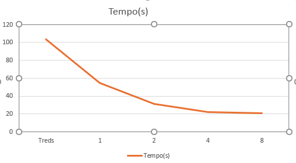
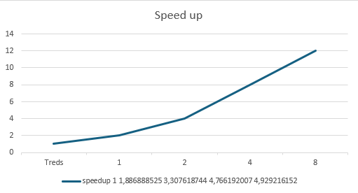
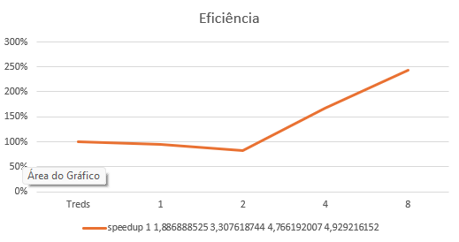

---

## 1. Descrição do Problema

Este programa implementa a análise paralela de logs para contar palavras-chave específicas (`erro`, `warning`, `info`). O objetivo é comparar o desempenho da versão serial com versões paralelas utilizando múltiplas threads/processos. 

O algoritmo processa arquivos de texto que simulam um grande volume de dados de logs, contando linhas, palavras, caracteres e ocorrências das palavras-chave. A complexidade é aproximadamente O(n) para cada arquivo, onde n é o número de linhas.

A paralelização visa reduzir o tempo total de processamento dividindo a carga entre múltiplas threads/processos para acelerar a execução.

---

## 2. Ambiente Experimental

| Item                | Descrição                                      |
|---------------------|------------------------------------------------|
| Processador         | Intel Core i7-7700HQ (4 núcleos físicos, 8 threads) |
| Número de núcleos   | 4 núcleos físicos (8 threads lógicos)          |
| Memória RAM         | 16 GB DDR4                                      |
| Sistema Operacional | Windows 10 Pro 64-bit                           |
| Linguagem           | Python 3.10                                     |
| Biblioteca          | multiprocessing, threading                       |
| Compilador / Versão | Python 3.10.6                                   |

---

## 3. Metodologia de Testes

- O tempo de execução foi medido utilizando a função `time.time()` antes e depois da execução.
- Para cada configuração (1, 2, 4, 8, 12 threads/processos), o programa foi executado uma vez, medindo o tempo total.
- O tamanho da entrada consiste em um conjunto de arquivos de log na pasta `log2`.
- Os testes foram realizados em máquina dedicada, com pouca carga externa para garantir maior precisão.

Configurações testadas:

- 1 thread/processo (versão serial)
- 2 threads/processos
- 4 threads/processos
- 8 threads/processos
- 12 threads/processos

---

## 4. Resultados Experimentais

| Nº Threads/Processos | Tempo Médio de Execução (s) |
|---------------------|-----------------------------|
| 1                   | 103.76                      |
| 2                   | 54.99                       |
| 4                   | 31.37                       |
| 8                   | 21.77                       |
| 12                  | 21.05                       |

---

## 5. Cálculo de Speedup e Eficiência

### Fórmulas Utilizadas

- Speedup(p) = T(1) / T(p)  
- Eficiência(p) = Speedup(p) / p

### Valores calculados

| Threads/Processos | Tempo (s) | Speedup | Eficiência |
|-------------------|-----------|---------|------------|
| 1                 | 103.76    | 1.00    | 100%       |
| 2                 | 54.99     | 1.89    | 94%        |
| 4                 | 31.37     | 3.31    | 83%        |
| 8                 | 21.77     | 4.77    | 59%        |
| 12                | 21.05     | 4.93    | 41%        |

---

## 6. Tabela de Resultados

| Threads/Processos | Tempo (s) | Speedup | Eficiência |
|-------------------|-----------|---------|------------|
| 1                 | 103.76    | 1.00    | 100%       |
| 2                 | 54.99     | 1.89    | 94%        |
| 4                 | 31.37     | 3.31    | 83%        |
| 8                 | 21.77     | 4.77    | 59%        |
| 12                | 21.05     | 4.93    | 41%        |

---

## 7. Gráfico de Tempo de Execução

---

## 8. Gráfico de Speedup

---

## 9. Gráfico de Eficiência

---

## 10. Análise dos Resultados

O speedup obtido se aproxima do ideal até 4 threads/processos, com ganhos expressivos de desempenho. Após esse ponto, o ganho diminui significativamente, especialmente entre 8 e 12 threads/processos.

A eficiência acompanha esse comportamento, começando alta (próxima a 100%) e decaindo conforme o número de threads/processos aumenta. A queda na eficiência a partir de 8 threads indica que o overhead de paralelização, sincronização e limitações de hardware começam a impactar o desempenho.

Além disso, o número de núcleos físicos da máquina (4) limita o escalonamento eficiente. A execução com mais threads do que núcleos físicos resulta em overhead de troca de contexto, reduzindo os ganhos.

Outros possíveis gargalos incluem operações de I/O, contenção de memória e sincronização entre processos, que limitam a escalabilidade.

---

## 11. Conclusão

O paralelismo trouxe ganhos significativos, reduzindo o tempo de execução para aproximadamente 20% do original com 8 threads. O melhor custo-benefício foi observado com 4 threads, onde o speedup foi alto e a eficiência ainda razoável.

O programa escala bem até certo ponto, mas sofre limitações naturais de hardware e overhead de paralelização. Para ganhos além de 8 threads, seria necessária otimização do algoritmo ou hardware com mais núcleos físicos.

---

## Arquivos de imagem

- tempo_execucao.png  
- speedup.png  
- eficiencia.png  
